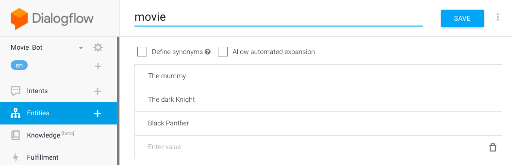
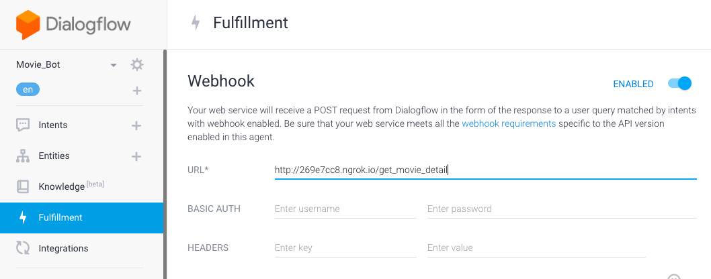

# DialogFlow Boilerplate

ChatBot Boilerplate using DialogFlow and Flask


## Technologies

* Python
* [Dialogflow](https://dialogflow.com/)
* [Flask](http://flask.pocoo.org/)
* [ngrok](https://ngrok.com/)
* JavaScript

## DialogFlow setup

1. Creating an agent

2. Creating an Intent:


2. Creating an Entity:


3. Fulfillment:


## Deployment

## Folders & Files

```
$ touch .env .flaskenv .gitignore README.md requirements.txt

$ mkdir -p src && cd src && mkdir templates static

$ touch app.py static/{custom.js,style.css} templates/index.html
```

### Virtual Environment using Bash

Creation of a virtual environments done by executing the command venv:
```
$ python3 -m venv env/
```

Command to activate virtual environment:
```
$ source env/bin/activate
```

Install dependencies:
```
(env) $ pip install -r requirements.txt
```

List the libraries installed on your environment:
```
(env) $ pip freeze
```

Run the development server:
```
(env) $ flask run
```

Exposing our localhost to the world
```
$ ngrok http localhost:5000
```

When you are done, the command to deactivate virtual environment:
```
(env) $ deactivate
```

# Resources

* https://pusher.com/tutorials/chatbot-flask-dialogflow